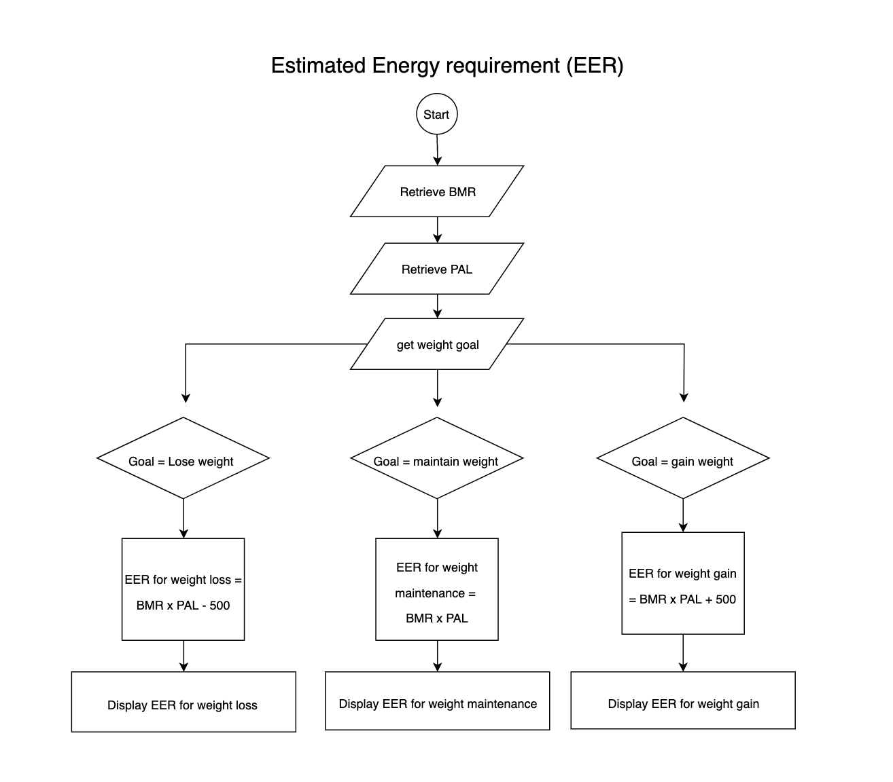

# Assessment 2: Plan and Implement a Terminal Application

# My Health App

## Statement of purpose and scope

The purpose of this terminal app is to allow users to gain valuable information about their health and tips for maintaining their health goals such as losing, gaining, or maintaining their weight. 

This health application will:
- Provide users with their Body Mass Index based on user input of their height and weight. 
  The user will be allocated within the ranges of underweight, normal weight, overweight or obese. 
- Calculate their daily estimated energy requirement (Kcals/day) for the selected user preference of gaining, losing, or maintaining weight.
- Provide recommended macronutrient intakes (protein, fats, carbohydrates) based on their daily estimated energy requirements. 

This app is developed as a reference for those who want to gain a deeper understanding of their health status and provide simple dietary advice for users who wish to improve on their health goals in regards to weight. This app also provides an estimated reference for users who wish to plan their meals specific to each macronutrient in order for them to achieve their goals such as bulking, cutting, or maintaining their current weight. 

Users will be able to check their Body Mass Index to see if they are within healthy weight ranges. Furthermore, the user will be asked what their goal is in terms of their weight (to gain, lose, or maintain weight). 

Once an answer has been determined, the user will be provided with a daily estimated energy requirement (Kcals/day) specific to their physical activity level, height, weight, and gender. 

To break this down further, The user will also be provided with a basic guideline of how many grams of each macronutrient (protein, fats, and carbohydrates) they should be consuming. This allows users to gain insight when planning meals in the future. 

## Features

#### Interactive user interface 
The use of command-line arguments allows users to choose their greeting before entering the app with the use of flags such as `--hello` and `--welcome`. A personal greeting is also available when the user types their name on the command line before opening the app.

Users can easily input their information by entering their own details with manual keyboard entry or with the use of a dropdown menu that allows them to pick from the options available. 

Question and answer format is easy to read and allows users to be guided throughout the process. The use of gems such as Pastel makes the interface easily legible with results appearing in a bold format to further highlight their value. 

#### Use of scientifically reviewed formulas for calculating health results

There are numerous equations derived from scientific literature that are used in creating this app and are currently being used in nutrition worldwide.

The formula that is used for calculating Body Mass Index is as follows: 

BMI = kg/m^2

The formula for calculating Basal Metabolic Rate is as follows:

BMR for males = 66.74 + (weight_in_kgs x 13.75) + (height_in_cms x 5.003) - (age x 6.755)

BMR for females = 655.1 + (9.563 x weight_in_kg) + (1.85 × height_in_cm) − (4.676 × age)

In order to attain the estimated energy requirement, a person's BMR will need to be multiplied by their physical activity level (PAL). As seen in the flowchart below for Physical Activity Level, the Harris-Benedict formula can be used to translate each response into numerical form that can then be used in our calculations.

Once the EER is calculated, the user input of weight goal in terms of gaining, maintaining, or losing weight is identified. For each weight goal, the addition or subtraction of 500Kcals/day will be used based on user input.

The formulas that will be used to calculate a persons estimated energy requirement (EER) for their weight goals are as follows:

EER for weight loss = BMR_for_males or BMR_for_females x PAL - 500

EER to maintain weight = BMR_for_males or BMR_for_females x PAL

EER to gain weight = BMR_for_males or BMR_for_females x PAL + 500

Following this, another formula will be used to calculate the recommended macronutrients for the user to consume. 

Protien in grams = EER for weight goal x 0.30 / 4

Fats in grams = EER for weight goal x 0.35 / 9

Carbohydrates in grams = EER for weight goal x 0.35 / 4 

#### Saves a copy of user results
Users are able to access a copy of their results from a text file called data.txt. This allows users to have a saved copy as a reference to use later on, particularly when planning meals according to their recommended macronutrient intake and daily caloric intake. 

The use of error handling when saving results onto a text file ensures that exceptions are raised if errors do occur. This allows for improved reliability of the file. 

## User interaction and experience 

#### Instructions 

1. Access the help-file and install necessary programs required. 
2. Once all requirements have been completed, input your name and a command line greeting from the available flag options of --hello or --welcome prior to running the app.
eg: `My_health_app.rb Mia --welcome`
3. Accurately answer the following questions from the chosen drop-down menus or input answer manually. 
4. Results will show on screen following input. 
5. To see current results, access the text file data.txt 

##### Requirements 
- Due to the chosen formulas for BMI and BMR, results are only rendered accurate if the user is an adult over the age of 18. If the user unputs their age being under 18, the program will show a `data input error` and the app will end. 
- It is also recommended that individuals who are weight training be advised that inaccuracies can occur with their Body Mass Index levels due to the misconception of heavier muscle mass being extra unwanted weight leading to resulting outputs of overweight or obese. 

## Flowchart 

The following flowcharts identify the control flow of the My Health App. It has been subdivided into 5 sections to show workflow of each feature. 

## Development Plan 

#### Feature 1 checklist:
- Create flowchart to plan layout and necessary requirements
- Create variables for data input such as height and weight etc.
- Use Gem tty-prompt to create drop-down menu for user to choose from selected choices. 
- Add Gem Pastel throughout the app
- Add introduction greeting and completion text
- Create Command line argument 

#### Feature 2 checklist: 
- Add BMI equation 
- Add BMR equation
- Add Estimated Energy Requirement (EER) equation
- Add macronutrient equation
- Create BMI and EER Class files 
- Create methods to link each acquired equation with user input 

#### Feature 3 checklist:
- Create an empty array called `output_data`
- Push required user inputs and results into array
- Create a new text file called data.txt
- Add array of data into data.txt
- Handle Errors with `Begin, Rescue, End` for exceptions of being unable to save output into selected file

#### Trello
The following images are screenshots from Trello that has assisted me in the development plan of this app. Deadlines were created within Trello to enure the planning process and completion of each task was done within the right timeframe. 

##### Trello update day 1:

##### Trello update day 2:

##### Trello update day 3:

#### Created by:
Mia Brunner 